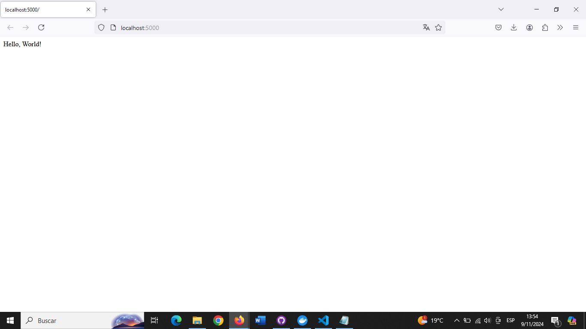

# Python Project: exercise1Python

This project is a simple web application using Python and Flask, using Docker for execution.

## Project Structure

- `app.py`: Main file containing the web application code using Flask.
- `Dockerfile`: Defines how the Docker image is built.
- `README.md`: Project documentation and execution file.
-`image.png`: Project execution image

## Prerequisites

Before running this project, you must have the following programs:

- **Docker**: to build and run the container. You can download Docker from [Docker Desktop](https://www.docker.com/products/docker-desktop).

- **Docker Hub Account**: to pull the project image directly from Docker Hub, make sure you have an account and are logged in.

## Manual Execution from Code

1. **Download the Project from GitHub**:

   - Go to the repository on GitHub and click on **"Code"**. Then select **"Download ZIP"** to download the project to your computer.
   - Unzip the ZIP file into a folder of your choice.

2. **Open a Terminal in the Project Folder**:

   - Navigate to the folder where you unzipped the project.
   - Open a terminal or command prompt (CMD) inside this folder. On Windows, you can right-click the folder and select **"Open PowerShell window here"**.

3. **Build the Docker Image**:

   Run the following command in the terminal to build the Docker image: Docker:
        docker build -t meybili/exercise1python .

2. **Run the container for the project**:

    Once the image has been built successfully, run the following command to start the container:
        docker run --name exercise1python -p 5000:5000 meybili/exercise1python

## Running from Docker Hub

1. **Pull the image from Docker Hub**:

    docker pull meybili/exercise1python:latest

2. **Run the container for the project**:

    docker run --name exercise1python -p 5000:5000 meybili/exercise1python

3. **Open your browser and navigate to http://localhost:5000⁠ to see the app.**

### Output Example

### Notes

- Make sure Docker is running.
- If you have problems accessing http://localhost:5000, check that the port is not in use or check your firewall.

## Credits

This project was developed by Meybili Olivares (https://github.com/meybili19).
